<div align="center">

<!-- Visitor Counter & Real-Time Status -->


<br/>
<br/>

<!-- Modern Animated Cyber HUD Banner (Red & Blue Laser Trace + Scanline) -->
<a href="https://github.com/Sensui-moksha">
  
</a>

<br/>

<!-- Animated Typing SVG (Neon Crimson Red & Cyan Vibe) -->
<a href="https://git.io/typing-svg">
  
</a>

<br/>
<br/>

<!-- Quick Action & Social Badges (Red & Blue Theme) -->
<a href="https://sensui-moksha-portfolio.vercel.app/">
  
</a>
<a href="https://www.linkedin.com/in/mokshyagnayadav/">
  
</a>
<a href="https://github.com/Sensui-moksha">
  
</a>
<a href="https://www.instagram.com/mokshyagnayadav/">
  
</a>

</div>

<br/>

<div align="center">
  
</div>

<br/>

## 🔴 SYSTEM PROFILE & BIO 🔷

<!-- Animated Interactive Cyber Terminal Window -->
<div align="center">
  
</div>

<br/>

<table border="0">
 <tr>
    <td width="58%" valign="top">

```typescript
const mokshyagna = {
  name: "Mokshyagna Yadav",
  handle: "Sensui-moksha",
  location: "Andhra Pradesh, India 🇮🇳",
  education: "B.Tech CSE @ MIC College of Technology",
  roles: [
    "Full-Stack Architect",
    "React & Cloud Systems Engineer",
    "Linux Terminal Power User"
  ],
  focusAreas: [
    "High-Performance Web & Micro-Architectures",
    "Applied AI & Real-Time Tooling",
    "Modern Component Systems & APIs"
  ],
  motto: "Ship meaningful code, optimize fearlessly.",
  funFact: "I debug with console.log and have zero regrets 😄"
};
```

- 🔴 **Full-Stack Engineering:** Designing performant, reactive user interfaces with TypeScript, React, and robust Node.js backends.
- 🔷 **Frontend & UI Systems:** Building reactive, high-performance interfaces with React, TypeScript, and modern CSS.
- 🔴 **Applied AI/ML:** Experimenting with neural models, automated developer agents, and computer vision pipelines.
- 🔷 **Linux Powerhouse:** Custom terminal-first workflows (Arch/Debian, Zsh, Neovim) tailored for maximum engineering throughput.
- 🔴 **Credentials:** Certified in **C, Python** (Infosys Springboard) & **Android Development** (Google).

 </td>
 <td width="42%" align="center" valign="middle">
   
   <br/>
   <sub><i>⚡ "Turning caffeine into robust distributed systems" ⚡</i></sub>
 </td>
 </tr>
</table>

<details>
<summary><b>🛠️ Click to Inspect Hardware & Terminal Environment</b></summary>
<br/>

- **Operating System:** Linux (Arch & Debian environments)
- **Shell:** Zsh configured with Starship prompt & automated workflow aliases
- **Editor:** Neovim & VS Code (Customized Keybindings & Tokyo Night / Cyberpunk theme)
- **Terminal Emulator:** Kitty / Alacritty with GPU-accelerated rendering
- **Version Control:** Git with Conventional Commits standard

</details>

<details>
<summary><b>📜 Click to Inspect Verified Certifications</b></summary>
<br/>

- 🏅 **Programming in C (Advanced)** — Infosys Springboard
- 🏅 **Python Programming & Data Structures** — Infosys Springboard
- 🏅 **Android Application Development** — Google Certified Training

</details>

<br/>

<div align="center">
  
</div>

<br/>

## 🔷  TECHNICAL ARSENAL 🔴

<!-- Animated Skill Proficiency Metrics HUD (Dynamically derived from published projects) -->
<div align="center">
  
</div>

<br/>

<div align="center">

  ### 🔴 Languages & Core Runtimes
  
  
  
  
  
  
  

  ### 🔷 Frameworks & Frontend
  
  
  
  
  

  ### 🔴 Database, Cloud & Backend APIs
  
  
  
  

  ### 🔷 Tooling, OS & DevOps
  
  
  
  
  

  ### ⚡ Unified Tech Matrix
  <a href="#-technical-arsenal-">
    
  </a>

</div>

<br/>

<div align="center">
  
</div>

<br/>

## 🔴 ARCHITECTURAL CODEX // CORE PRINCIPLES 🔷

<table border="0" width="100%">
  <tr>
    <td width="50%" valign="top">
      <h4>⚡ 01 // SUB-SECOND REACTIVITY</h4>
      <p>Building client-side applications that respond instantaneously. Prioritizing zero redundant re-renders, optimistic UI mutations, and resilient state machines.</p>
    </td>
    <td width="50%" valign="top">
      <h4>🛡️ 02 // STRICT TYPE RIGOR</h4>
      <p>TypeScript-first engineering with strict schema validation. Type safety isn't just about catching runtime errors—it's about self-documenting, maintainable architecture.</p>
    </td>
  </tr>
  <tr>
    <td width="50%" valign="top">
      <h4>🐧 03 // TERMINAL VELOCITY &amp; AUTOMATION</h4>
      <p>Linux-native development with Neovim, Zsh, and Git automation. Every repetitive workflow is scripted; every push is verified by CI/CD pipelines.</p>
    </td>
    <td width="50%" valign="top">
      <h4>🧠 04 // APPLIED AI &amp; NEXT-GEN SYSTEMS</h4>
      <p>Integrating intelligent developer agents, neural API integrations, and edge runtime logic to solve complex real-world operational problems.</p>
    </td>
  </tr>
</table>

<br/>

<div align="center">
  
</div>

<br/>

## 🔴 TELEMETRY & GITHUB ANALYTICS 🔷

<div align="center">

  <!-- Dynamic GitHub Profile Trophies (Radical Red & Blue Dark Theme) -->
  <a href="https://github.com/Sensui-moksha">
    
  </a>

  <br/><br/>

  <!-- Red & Blue Neon Animated Streak Stats (Live Flame Animation) -->
  <a href="https://github.com/Sensui-moksha">
    
  </a>

  <br/><br/>

  <!-- Red & Blue Themed GitHub Stats and Top Languages Side-by-Side -->
  <table border="0" align="center">
    <tr>
      <td align="center" valign="middle">
        
      </td>
      <td align="center" valign="middle">
        
      </td>
    </tr>
  </table>

</div>

<br/>

<div align="center">
  
</div>

<br/>

## 🔷  FEATURED REPOSITORIES &amp; FLAGSHIP BUILDS 🔴

<table border="0" width="100%">
  <tr>
    <td width="50%" valign="top">
      <h4>🚀 EventHub — College Event Platform</h4>
      <p><b>Stack:</b> <code>React 18</code> <code>TypeScript</code> <code>Node.js</code> <code>MongoDB</code></p>
      <p>A full-stack campus event ecosystem featuring role-based registration, automated QR ticketing, real-time RSVP telemetry, and event analytics.</p>
      <a href="https://github.com/Sensui-moksha/EventHub---College-Event-Management-System">
        
      </a>
    </td>
    <td width="50%" valign="top">
      <h4>⚡ Intellica — Faculty Appraisal Engine</h4>
      <p><b>Stack:</b> <code>JavaScript</code> <code>Node.js</code> <code>Express</code> <code>MongoDB</code></p>
      <p>Institutional-grade academic performance and appraisal management portal with multi-tier approval workflows, research scoring, and audit compliance.</p>
      <a href="https://github.com/Sensui-moksha/Intellica">
        
      </a>
    </td>
  </tr>
  <tr>
    <td width="50%" valign="top">
      <h4>🛡️ Campus Check-In — Attendance System</h4>
      <p><b>Stack:</b> <code>TypeScript</code> <code>React</code> <code>Node.js</code> <code>REST APIs</code></p>
      <p>High-reliability attendance management system with granular role access (Admin, Principal, Faculty), automated attendance analytics, and absence alerts.</p>
      <a href="https://github.com/Sensui-moksha/campus-check-in-Attendance-Managment-System">
        
      </a>
    </td>
    <td width="50%" valign="top">
      <h4>🌐 Civic Resolve Chain — Resolution Platform</h4>
      <p><b>Stack:</b> <code>TypeScript</code> <code>React</code> <code>Web3 / IPFS</code> <code>Decentralized</code></p>
      <p>Decentralized civic governance platform enabling communities to document, verify, and resolve municipal issues with transparent proof-of-work.</p>
      <a href="https://github.com/Sensui-moksha/CIVIC-RESOLVE-CHAIN">
        
      </a>
    </td>
  </tr>
</table>

<br/>

<!-- PROJECTS:START -->
> 🤖 _Last synced: Sun, 13 Sep 2026 02:18:00 GMT_

### 🏗️ My Projects

<div align="center">

| # | 📁 Project | 📝 Description | 🔧 Stack | ⭐ Stars |
|:---:|:---|:---|:---:|:---:|
| 1 | [EVENT--HUB-College-Version](https://github.com/Sensui-moksha/EVENT--HUB-College-Version) | — | `TypeScript` |  |
| 2 | [Sensui-moksha.github.io](https://github.com/Sensui-moksha/Sensui-moksha.github.io) | 🚀 Personal portfolio website of Mokshyagna Yadav – a passionate full-stack developer and Linux enthusiast. Built with H | `TypeScript` |  |
| 3 | [Intellica](https://github.com/Sensui-moksha/Intellica) | Intellica is an institutional-grade Faculty Appraisal & Research Performance Management portal. Features multi-tier appr | `JavaScript` |  |
| 4 | [campus-check-in-Attendance-Managment-System](https://github.com/Sensui-moksha/campus-check-in-Attendance-Managment-System) | A modern full-stack attendance management system for educational institutions. Features role-based access (Admin, Princi | `TypeScript` |  |
| 5 | [EventHub---College-Event-Management-System](https://github.com/Sensui-moksha/EventHub---College-Event-Management-System) | EventHub is a modern full-stack college event management system built with React 18, TypeScript, Node.js, and MongoDB. F | `TypeScript` |  |
| 6 | [Weather-Forecast](https://github.com/Sensui-moksha/Weather-Forecast) | 🌦️ Weather Forecast Web AppA simple responsive weather app that displays real-time weather data for any city using a pu | `CSS` |  |
| 7 | [CIVIC-RESOLVE-CHAIN](https://github.com/Sensui-moksha/CIVIC-RESOLVE-CHAIN) | DeFix A decentralized platform that empowers communities to document and resolve local civic issues using blockchain tec | `TypeScript` |  |
| 8 | [NFT-Achievement-System](https://github.com/Sensui-moksha/NFT-Achievement-System) | About An NFT Achievement System uses blockchain to issue verifiable digital badges as NFTs for milestones in education,  | `TypeScript` |  |
| 9 | [Aptos-D-app](https://github.com/Sensui-moksha/Aptos-D-app) | — | `JavaScript` |  |

</div>

<!-- PROJECTS:END -->

<br/>

<div align="center">
  
</div>

<br/>

## 🔴 CODE VELOCITY & COMMIT RADAR 🔷

<!-- Animated Cyberpunk Commit Telemetry Radar & Sonar Sweep -->
<div align="center">
  
</div>

<br/>

<!-- Live GitHub Contribution Activity Heatmap (Neon Crimson Palette) -->
<div align="center">
  <a href="https://github.com/Sensui-moksha">
    
  </a>
  <br/>
  <sub>⚡ <i>Live contribution telemetry synced directly from GitHub commit history</i> ⚡</sub>
</div>

<br/>

<details>
<summary><b>🎮 Click to View Classic Contribution Snake Game</b></summary>
<br/>
<div align="center">
  <picture>
    <source media="(prefers-color-scheme: dark)" srcset="https://raw.githubusercontent.com/Sensui-moksha/Sensui-moksha/output/github-contribution-grid-snake-dark.svg" />
    <source media="(prefers-color-scheme: light)" srcset="https://raw.githubusercontent.com/Sensui-moksha/Sensui-moksha/output/github-contribution-grid-snake.svg" />
    
  </picture>
</div>
</details>

<br/>

<div align="center">
  
</div>

<br/>

## 🔷  ESTABLISH UPLINK // LET'S CONNECT 🔴

<div align="center">

  <p>Got an exciting idea, full-stack challenge, or intelligent product concept? Let's engineer something remarkable together.</p>

  <!-- Connect Badges with High Contrast Red & Blue Theme -->
  <a href="https://sensui-moksha-portfolio.vercel.app/">
    
  </a>
  &nbsp;
  <a href="https://www.linkedin.com/in/mokshyagnayadav/">
    
  </a>
  &nbsp;
  <a href="https://github.com/Sensui-moksha">
    
  </a>
  &nbsp;
  <a href="https://www.instagram.com/mokshyagnayadav/">
    
  </a>

  <br/><br/>

  > <i>"Code is like humor. When you have to explain it, it's bad."</i> — **Cory House**

  <br/>

  <!-- Footer Waving Banner (Neon Red & Electric Blue Gradient) -->
  

</div>
